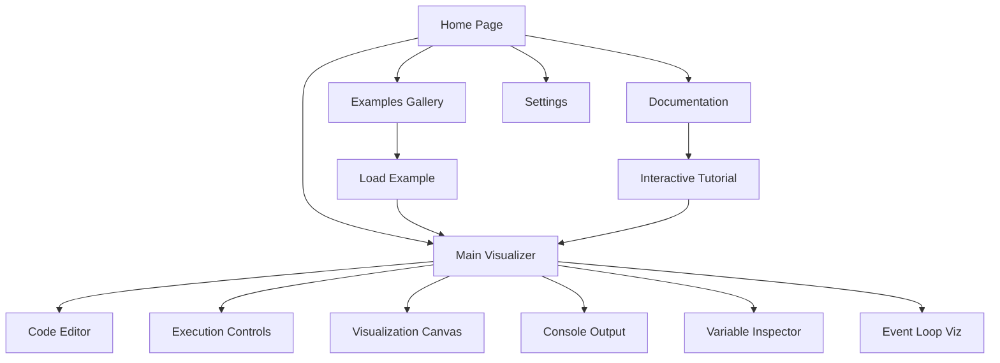

## 1. Product Overview
JavaScript Execution Visualizer provides real-time, step-by-step visualization of JavaScript code execution at the engine level. This educational tool helps developers understand complex JavaScript concepts like closures, event loop, and async operations through interactive visual demonstrations.

Target users include JavaScript learners, educators, and developers seeking deeper understanding of JavaScript engine behavior. The product offers comprehensive visualization of execution contexts, memory management, and asynchronous operations.

## 2. Core Features

### 2.1 User Roles
| Role | Registration Method | Core Permissions |
|------|---------------------|------------------|
| Guest User | No registration required | Access pre-built examples, basic visualization |
| Registered User | Email registration | Save custom code, share visualizations, set preferences |

### 2.2 Feature Module
The JavaScript Execution Visualizer consists of the following main pages:
1. **Main Visualizer Page**: Code editor, execution controls, visualization canvas, console output, variable inspector, event loop visualization
2. **Examples Gallery Page**: Pre-built examples demonstrating JavaScript concepts
3. **Documentation Page**: Interactive tutorials and comprehensive guides
4. **Settings Page**: Theme preferences, animation speed, export options

### 2.3 Page Details
| Page Name | Module Name | Feature description |
|-----------|-------------|---------------------|
| Main Visualizer | Code Editor Panel | Syntax highlighting, line numbers, ES6+ support, auto-indentation, code folding |
| Main Visualizer | Execution Controls | Play, pause, step-over, step-into, reset buttons with keyboard shortcuts |
| Main Visualizer | Visualization Canvas | Animated call stack, scope chain, variable environment, memory heap visualization |
| Main Visualizer | Console Output Panel | Display console.log statements, error messages with syntax highlighting |
| Main Visualizer | Variable Inspector | Show current values, types, references for all variables in scope with color-coded changes |
| Main Visualizer | Event Loop Visualization | Demonstrate interaction between call stack, callback queue, and microtask queue |
| Main Visualizer | Breakpoint Manager | Set/remove breakpoints, conditional breakpoints, breakpoint list |
| Examples Gallery | Concept Categories | Closures, prototypes, event loop, async operations, ES6+ features |
| Examples Gallery | Interactive Examples | Load and run pre-built examples with step-by-step explanations |
| Documentation | Interactive Tutorials | Guided walkthroughs for beginners and advanced users |
| Settings | Theme Toggle | Dark/light theme switching with system preference detection |
| Settings | Animation Controls | Speed controls for animation playback (0.5x to 3x) |
| Settings | Export Options | Share visualizations via URL, export as GIF/video, code sharing |

## 3. Core Process
### Guest User Flow
1. User lands on Main Visualizer page with default example loaded
2. User can modify code in the editor or load from examples gallery
3. User controls execution through play/pause/step buttons
4. Visualization updates in real-time showing execution state
5. User can export/share visualizations if desired

### Registered User Flow
1. User logs in to access saved visualizations and preferences
2. User can save custom code snippets and visualization states
3. User can share visualizations with others via generated links
4. User can access advanced features like custom themes and export options

## 4. User Interface Design
### 4.1 Design Style
- **Primary Colors**: Deep blue (#1e40af) for primary actions, emerald (#10b981) for success states
- **Secondary Colors**: Gray scale for backgrounds and text, orange (#f59e0b) for warnings
- **Button Style**: Rounded corners (8px radius), subtle shadows, hover animations
- **Font**: Inter for UI elements, Fira Code for code editor (monospace)
- **Layout**: Card-based design with clear visual hierarchy, resizable panels
- **Icons**: Lucide React icons for consistency, animated icons for execution states

### 4.2 Page Design Overview
| Page Name | Module Name | UI Elements |
|-----------|-------------|-------------|
| Main Visualizer | Code Editor | Dark theme syntax highlighting, line numbers, minimap, auto-completion |
| Main Visualizer | Execution Controls | Floating control bar with play/pause icons, speed slider, step buttons |
| Main Visualizer | Visualization Canvas | Animated SVG/Canvas rendering, smooth transitions, color-coded scopes |
| Main Visualizer | Console Output | Terminal-style output with syntax highlighting, scrollable container |
| Main Visualizer | Variable Inspector | Tree view with expandable nodes, type badges, reference indicators |
| Main Visualizer | Event Loop | Circular diagram with animated arrows, queue counters, timing indicators |
| Examples Gallery | Category Cards | Grid layout with preview thumbnails, difficulty badges, load buttons |
| Documentation | Tutorial Steps | Step-by-step progression, interactive code examples, progress tracking |

### 4.3 Responsiveness
- Desktop-first design with mobile-adaptive layout
- Responsive breakpoints: 320px, 768px, 1024px, 1440px
- Touch interaction optimization for tablet devices
- Collapsible panels for smaller screens
- Horizontal scrolling for code editor on mobile

### 4.4 Animation Guidelines
- Smooth transitions between execution states (300ms ease-in-out)
- Color-coded variable changes (green for new, yellow for modified, red for deleted)
- Function call animations with parameter passing visualization
- Promise resolution chains with async/await flow indication
- Memory allocation and garbage collection visualization