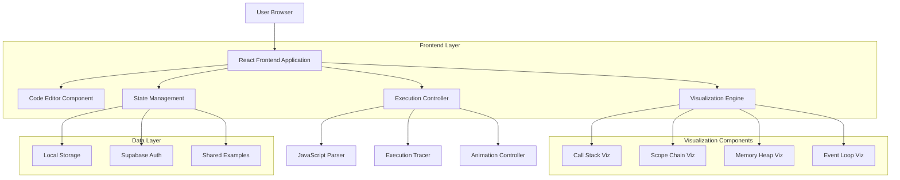
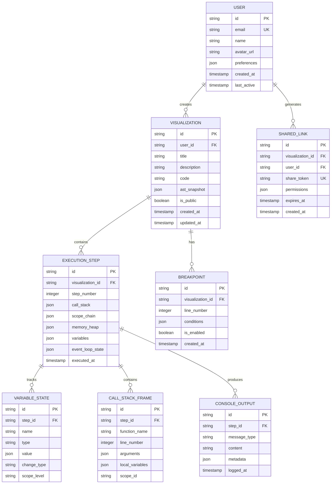

## 1. Architecture design


## 2. Technology Description
- Frontend: React@18 + TypeScript + Vite
- UI Framework: TailwindCSS@3 + HeadlessUI
- Code Editor: Monaco Editor (VS Code editor)
- Visualization: D3.js@7 + Framer Motion (animations)
- State Management: Zustand
- Authentication: Supabase Auth
- Storage: Supabase Database + Local Storage
- Build Tool: Vite
- Testing: Vitest + React Testing Library
- Initialization Tool: vite-init

## 3. Route definitions
| Route | Purpose |
|-------|---------|
| / | Main visualizer page with code editor and visualization |
| /examples | Gallery of pre-built examples categorized by concepts |
| /docs | Interactive documentation and tutorials |
| /settings | User preferences and export options |
| /share/:id | Shared visualization link |
| /tutorial/:id | Specific tutorial walkthrough |

## 4. Component Architecture
### 4.1 Core Components
```typescript
interface VisualizationState {
  executionStep: number;
  callStack: CallFrame[];
  scopeChain: Scope[];
  memoryHeap: MemoryObject[];
  eventLoop: EventLoopState;
  variables: Variable[];
  consoleOutput: ConsoleMessage[];
  isExecuting: boolean;
  executionSpeed: number;
}

interface CodeExecution {
  id: string;
  code: string;
  ast: ASTNode;
  executionSteps: ExecutionStep[];
  breakpoints: number[];
  currentStep: number;
}

interface AnimationConfig {
  duration: number;
  easing: string;
  delay: number;
  stagger: number;
}
```

### 4.2 Execution Engine
```typescript
interface ExecutionTracer {
  parseCode(code: string): ASTNode;
  instrumentCode(ast: ASTNode): InstrumentedCode;
  executeStep(step: ExecutionStep): VisualizationState;
  handleAsyncOperation(op: AsyncOperation): Promise<void>;
  manageScope(scope: Scope): void;
  trackMemoryAllocation(obj: any): MemoryObject;
}
```

## 5. Data model
### 5.1 Data model definition


### 5.2 Data Definition Language
```sql
-- Users table
CREATE TABLE users (
    id UUID PRIMARY KEY DEFAULT gen_random_uuid(),
    email VARCHAR(255) UNIQUE NOT NULL,
    name VARCHAR(100) NOT NULL,
    avatar_url TEXT,
    preferences JSONB DEFAULT '{}',
    created_at TIMESTAMP WITH TIME ZONE DEFAULT NOW(),
    last_active TIMESTAMP WITH TIME ZONE DEFAULT NOW()
);

-- Visualizations table
CREATE TABLE visualizations (
    id UUID PRIMARY KEY DEFAULT gen_random_uuid(),
    user_id UUID REFERENCES users(id) ON DELETE CASCADE,
    title VARCHAR(255) NOT NULL,
    description TEXT,
    code TEXT NOT NULL,
    ast_snapshot JSONB NOT NULL,
    is_public BOOLEAN DEFAULT false,
    created_at TIMESTAMP WITH TIME ZONE DEFAULT NOW(),
    updated_at TIMESTAMP WITH TIME ZONE DEFAULT NOW()
);

-- Execution steps table
CREATE TABLE execution_steps (
    id UUID PRIMARY KEY DEFAULT gen_random_uuid(),
    visualization_id UUID REFERENCES visualizations(id) ON DELETE CASCADE,
    step_number INTEGER NOT NULL,
    call_stack JSONB NOT NULL,
    scope_chain JSONB NOT NULL,
    memory_heap JSONB NOT NULL,
    variables JSONB NOT NULL,
    event_loop_state JSONB NOT NULL,
    executed_at TIMESTAMP WITH TIME ZONE DEFAULT NOW()
);

-- Variable states table
CREATE TABLE variable_states (
    id UUID PRIMARY KEY DEFAULT gen_random_uuid(),
    step_id UUID REFERENCES execution_steps(id) ON DELETE CASCADE,
    name VARCHAR(255) NOT NULL,
    type VARCHAR(50) NOT NULL,
    value JSONB NOT NULL,
    change_type VARCHAR(20) CHECK (change_type IN ('new', 'modified', 'deleted')),
    scope_level VARCHAR(100),
    created_at TIMESTAMP WITH TIME ZONE DEFAULT NOW()
);

-- Console output table
CREATE TABLE console_outputs (
    id UUID PRIMARY KEY DEFAULT gen_random_uuid(),
    step_id UUID REFERENCES execution_steps(id) ON DELETE CASCADE,
    message_type VARCHAR(20) CHECK (message_type IN ('log', 'error', 'warn', 'info')),
    content TEXT NOT NULL,
    metadata JSONB DEFAULT '{}',
    logged_at TIMESTAMP WITH TIME ZONE DEFAULT NOW()
);

-- Shared links table
CREATE TABLE shared_links (
    id UUID PRIMARY KEY DEFAULT gen_random_uuid(),
    visualization_id UUID REFERENCES visualizations(id) ON DELETE CASCADE,
    user_id UUID REFERENCES users(id) ON DELETE CASCADE,
    share_token VARCHAR(255) UNIQUE NOT NULL,
    permissions JSONB DEFAULT '{"read": true, "write": false}',
    expires_at TIMESTAMP WITH TIME ZONE,
    created_at TIMESTAMP WITH TIME ZONE DEFAULT NOW()
);

-- Breakpoints table
CREATE TABLE breakpoints (
    id UUID PRIMARY KEY DEFAULT gen_random_uuid(),
    visualization_id UUID REFERENCES visualizations(id) ON DELETE CASCADE,
    line_number INTEGER NOT NULL,
    conditions JSONB DEFAULT '{}',
    is_enabled BOOLEAN DEFAULT true,
    created_at TIMESTAMP WITH TIME ZONE DEFAULT NOW()
);

-- Indexes for performance
CREATE INDEX idx_visualizations_user_id ON visualizations(user_id);
CREATE INDEX idx_visualizations_created_at ON visualizations(created_at DESC);
CREATE INDEX idx_execution_steps_visualization_id ON execution_steps(visualization_id);
CREATE INDEX idx_execution_steps_step_number ON execution_steps(visualization_id, step_number);
CREATE INDEX idx_variable_states_step_id ON variable_states(step_id);
CREATE INDEX idx_console_outputs_step_id ON console_outputs(step_id);
CREATE INDEX idx_shared_links_token ON shared_links(share_token);
CREATE INDEX idx_breakpoints_visualization_id ON breakpoints(visualization_id);

-- Row Level Security (RLS) policies
ALTER TABLE visualizations ENABLE ROW LEVEL SECURITY;
ALTER TABLE execution_steps ENABLE ROW LEVEL SECURITY;
ALTER TABLE shared_links ENABLE ROW LEVEL SECURITY;
ALTER TABLE breakpoints ENABLE ROW LEVEL SECURITY;

-- RLS Policies
CREATE POLICY "Users can view their own visualizations" ON visualizations
    FOR SELECT USING (auth.uid() = user_id OR is_public = true);

CREATE POLICY "Users can insert their own visualizations" ON visualizations
    FOR INSERT WITH CHECK (auth.uid() = user_id);

CREATE POLICY "Users can update their own visualizations" ON visualizations
    FOR UPDATE USING (auth.uid() = user_id);

CREATE POLICY "Users can delete their own visualizations" ON visualizations
    FOR DELETE USING (auth.uid() = user_id);
```

## 6. Visualization Implementation
### 6.1 Animation System
```typescript
interface AnimationController {
  transitionToState(state: VisualizationState): Promise<void>;
  animateFunctionCall(frame: CallFrame): Promise<void>;
  animateVariableChange(variable: Variable, changeType: string): Promise<void>;
  animateScopeTraversal(scope: Scope): Promise<void>;
  animateEventLoopTransition(event: EventLoopEvent): Promise<void>;
}
```

### 6.2 Performance Optimization
- Virtual scrolling for large call stacks
- Memoization of expensive computations
- Debounced updates for rapid state changes
- Web Workers for heavy parsing operations
- Canvas rendering for complex visualizations

## 7. Security Considerations
- Sandboxed code execution environment
- Input validation and sanitization
- Rate limiting for shared visualizations
- Content Security Policy headers
- XSS protection for user-generated content